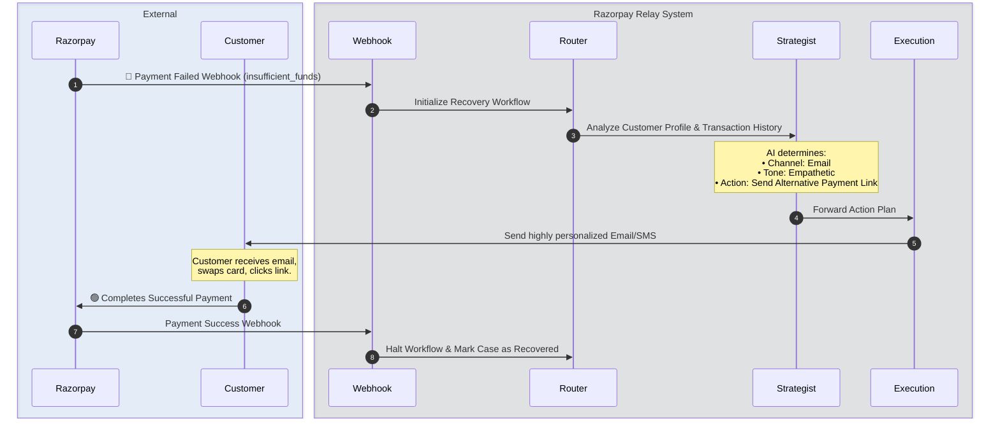

<!-- 
  Beautiful README for Razorpay Relay
  Inspired by top-tier open source projects (Vercel, Stripe, Langchain)
-->

<div align="center">
  
  <br />
  <h1>🚀 Razorpay Relay</h1>
  <p>
    <strong>Next-Generation Agentic AI for Revenue Recovery</strong>
  </p>
  <p>
    Turn <i>Failed Payments</i> and <i>Abandoned Carts</i> into successful conversions using intelligent, autonomous multi-agent workflows. Built for modern e-commerce.
  </p>

  <p>
    <a href="https://github.com/sanyam-15/Buildathon/stargazers"></a>
    <a href="https://github.com/sanyam-15/Buildathon/network/members"></a>
    <a href="https://github.com/sanyam-15/Buildathon/issues"></a>
  </p>

  <p>
    
    
    
    
    
  </p>
</div>

<hr />

## 🌟 The Vision

Businesses lose millions to **failed payments** and **abandoned carts**. Traditional recovery methods rely on static rules, generic templates, and fixed time delays. They are essentially blind to the *context* of the failure and the *behavior* of the customer.

**Razorpay Relay** changes the game. It deploys a team of specialized AI agents that dynamically analyze payment failures, formulate personalized recovery strategies, execute targeted outreach, and adapt based on real-time customer behavior.

<br />

## ✨ Core Features

| Feature | Description |
| :--- | :--- |
| 🧠 **Multi-Agent Orchestration** | Powered by **LangGraph**, utilizing specialized agents (Strategist, Execution, Monitor, Sentinel) for complex decision-making. |
| ⚡ **Real-Time Next.js Command Center** | A stunning, reactive dashboard that visualizes agent deliberation, live logs, and revenue metrics as they happen. |
| 🎯 **Context-Aware Recovery** | AI dynamically determines the best channel (Email/SMS), tone (Empathetic/Urgent), and offer (Discount/Link) for each unique customer. |
| 🛡️ **Built-in Guardrails** | Strict adherence to communication policies, tone guidelines, and retry limits to protect your brand's reputation. |
| 🔌 **Seamless Integrations** | Designed to integrate natively with **Razorpay** webhooks and modern communication APIs like **Resend**. |

<br />

## 📐 System Architecture

Razorpay Relay is built on a modern, decoupled stack. The backend is a robust Python/FastAPI service driving the LangGraph orchestration, while the frontend is a sleek Next.js dashboard providing real-time observability.

```mermaid
%%{init: {'theme': 'dark', 'themeVariables': { 'fontFamily': 'Inter', 'primaryColor': '#1E293B', 'edgeLabelBackground':'#2B84EA'}}}%%
graph TD
    %% Define Classes
    classDef frontend fill:#000000,stroke:#333,stroke-width:2px,color:#fff
    classDef backend fill:#0F172A,stroke:#2B84EA,stroke-width:2px,color:#fff
    classDef agents fill:#2B84EA,stroke:#60A5FA,stroke-width:2px,color:#fff
    classDef external fill:#16A34A,stroke:#4ADE80,stroke-width:2px,color:#fff

    subgraph User Interface
        UI[💻 Next.js Dashboard]:::frontend
        AG[🕸️ Live Agent Graph]:::frontend
        Metrics[📊 Revenue Metrics]:::frontend
    end

    subgraph Core Engine
        API[⚡ FastAPI Server]:::backend
        EB[📨 Event Bus]:::backend
        DB[(🗄️ SQLite Database)]:::backend
    end

    subgraph AI Orchestration (LangGraph)
        Router((🚦 Router)):::agents
        Strat[🧠 Strategist Agent]:::agents
        Exec[⚙️ Execution Agent]:::agents
        Mon[👀 Monitor Agent]:::agents
    end
    
    subgraph External Services
        RP[💳 Razorpay Gateway]:::external
        Email[✉️ Resend API]:::external
    end

    %% Connections
    UI <-->|REST / WebSockets| API
    AG <--> API
    RP -- Webhook --> API
    API --> EB
    API <--> DB
    EB --> Router
    
    Router --> Strat
    Strat --> Exec
    Exec --> Mon
    Exec -.-> Email
```

<br />

## 🌊 Agent Orchestration Flow

How does the magic happen when a payment fails? Here is the lifecycle of a recovery case:



<br />

## 📸 Dashboard Sneak Peek

> **Note for Judges/Reviewers**: Insert actual screenshots of the local application here to showcase the beautiful UI!

<p align="center">
  
</p>

<p align="center">
  
</p>

<br />

## 🚀 Getting Started

Follow these instructions to get a local copy up and running.

### Prerequisites
- Node.js (v18+)
- Python (3.10+)
- OpenAI / Gemini API Keys

### 1. Clone & Install
```bash
git clone https://github.com/sanyam-15/Buildathon.git
cd Buildathon
```

### 2. Backend Environment
```bash
cd backend
python -m venv .venv

# Activate Virtual Environment
# Windows:
.venv\Scripts\activate
# Mac/Linux:
source .venv/bin/activate

pip install -r requirements.txt

# Environment Variables
cp .env.example .env
# Edit .env and add your LLM API keys (OPENAI_API_KEY)
```

### 3. Start the Engines
You need two terminal windows to run the stack.

**Terminal 1 (Backend):**
```bash
cd backend
python run.py
# Server starts on http://localhost:8000
```

**Terminal 2 (Frontend):**
```bash
cd frontend
npm install
npm run dev
# Dashboard starts on http://localhost:3000
```

<br />

## 🗂️ Project Structure Highlights

- `backend/app/agents/`: The core LangGraph agents (Strategist, Execution, Monitor, etc.) containing the LLM prompts and decision logic.
- `backend/app/graph/`: The state definitions and routing logic for the LangGraph workflow.
- `backend/app/services/`: Integrations with external providers (Razorpay, Email, etc.).
- `frontend/components/agent/`: The React components responsible for rendering the live visual representation of the agent graph.

<br />

---

<div align="center">
  <p>
    Built with 🩵 for the ultimate hackathon experience.
  </p>
</div>
