<div align="center">
  <br />
  <h1>⚡ Razorpay Relay</h1>
  <p>
    <strong>Autonomous AI Revenue Recovery Engine</strong>
  </p>
  <p>
    Detect · Diagnose · Decide · Act · Observe · Replan<br />
    Across <strong>B2C consumer payments</strong> and <strong>B2B receivables</strong>
  </p>

  <p>
    
    
  </p>

  <p>
    
    
    
    
    
  </p>
</div>

---

## 🎯 What is Razorpay Relay?

**Razorpay Relay** is a closed-loop, multi-agent system that finds revenue slipping away and works to win it back — not with static drip reminders, but with adaptive AI that remembers previous attempts, observes outcomes, and replans when an intervention fails.

| Segment | Revenue at risk | How Relay recovers it |
|---------|-----------------|------------------------|
| **B2C** | Failed payments, abandoned checkouts, subscription renewals | Investigate transaction + customer context → retry, payment link, email/WhatsApp, discount, or stop |
| **B2B** | Overdue invoices & receivables | Age the invoice → score payment history → plan remind / wait / escalate / stop → collections tone + audit trail |

> Traditional tools apply the **same reminder sequence** to every failure.<br />
> Relay chooses the **right intervention for this case, right now** — then learns from the outcome.

---

## 💥 The Problem We Solve

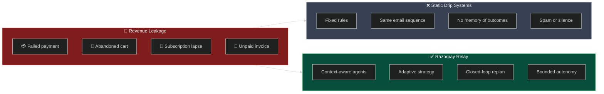

Revenue loss rarely happens in one predictable step. A bank timeout, a distracted shopper, a failed renewal, or a 45-day overdue invoice each need a **different** response. Static systems cannot diagnose root cause, respect cooldowns intelligently, or escalate only when it is worth it.

**Relay closes the loop.**

---

## 🆚 What Makes Relay Different

| Capability | Traditional recovery | Razorpay Relay |
|------------|----------------------|----------------|
| Decisioning | If/else + drip timers | Multi-agent LangGraph orchestration |
| Context | Amount + template | History, signals, aging, response behavior |
| Memory | Stateless campaigns | Remembers attempts, outcomes, replans |
| B2C + B2B | Usually separate products | One engine, dual specialist paths |
| Safety | Soft limits (or none) | Deterministic **Policy Engine** (non-LLM) |
| Observability | Logs after the fact | **Live Agent Graph** + SSE console |
| Stopping rules | Rarely enforced | Attempt caps, cooldowns, escalate / stop |

---

## 🧬 Dual-Segment Product Model

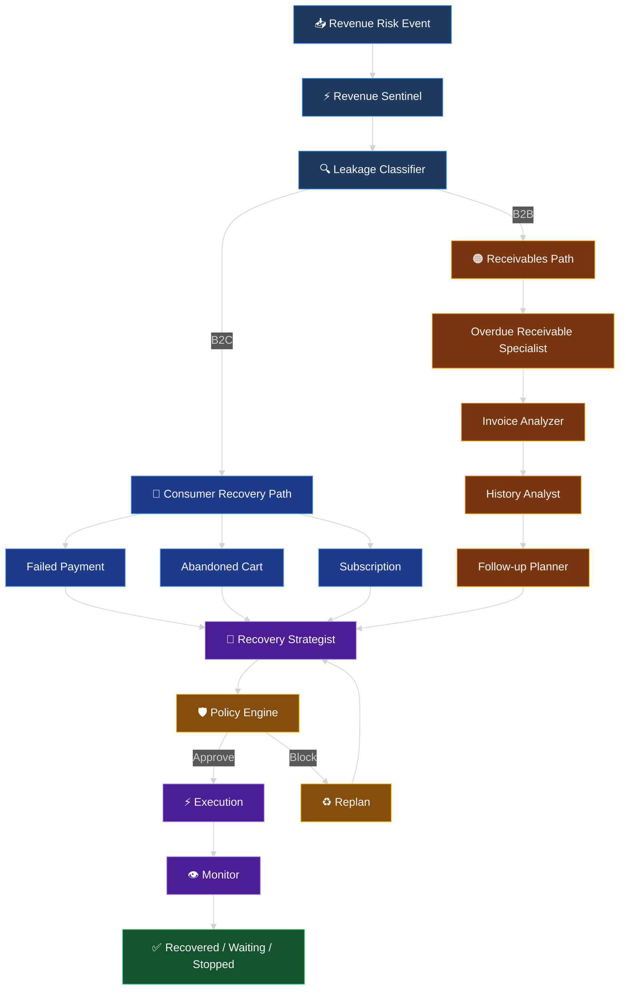

---

## 🕸️ Live Agent Graph (Full Topology)

This is the **exact LangGraph topology** rendered live in the Command Center (React Flow + SSE).

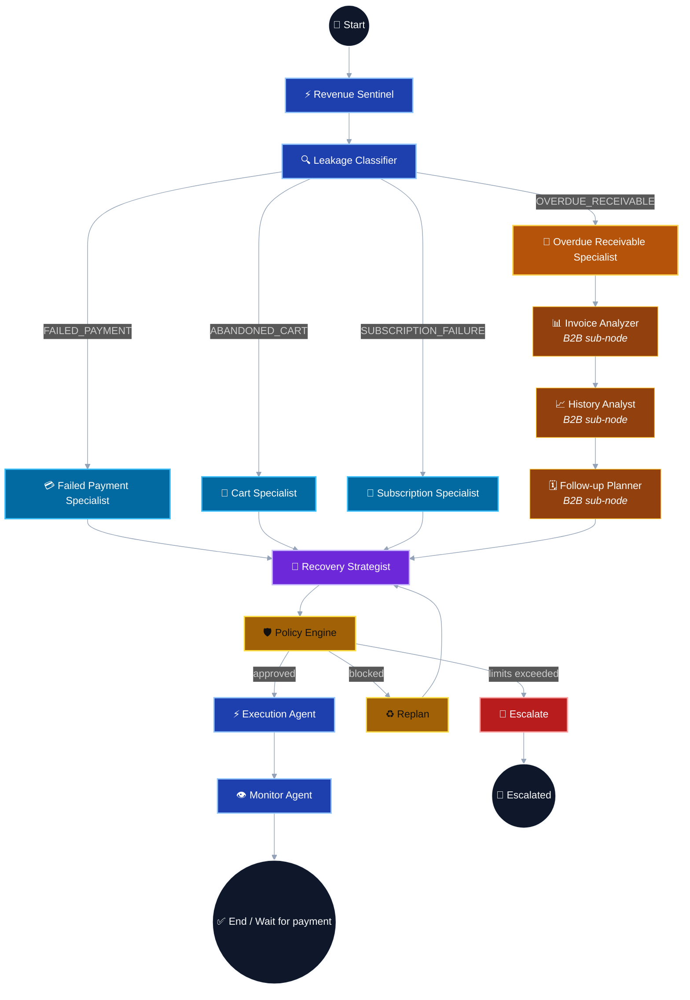

**Legend**

| Color | Meaning |
|-------|---------|
| 🔵 Blue | Shared pipeline / B2C specialists |
| 🟠 Amber | B2B receivables specialist + sub-nodes |
| 🟣 Purple | AI strategist decisions |
| 🟡 Gold | Deterministic policy / replan |
| 🟢 Green | Terminal success / wait |
| 🔴 Red | Human escalation |

---

## 🧩 UML — Component Architecture

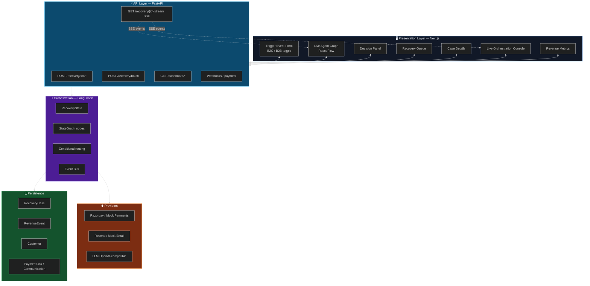

---

## 📐 UML — Sequence (B2C Failed Payment)

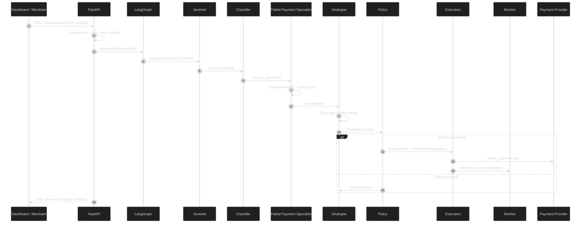

---

## 📐 UML — Sequence (B2B Overdue Receivable)

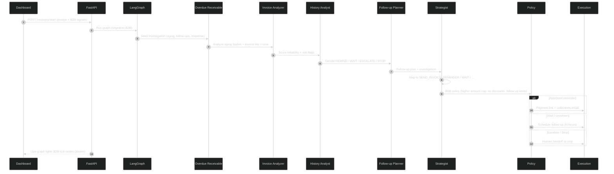

---

## 🔵 B2C — Consumer Payment Recovery

### How we solve B2C leakage

1. **Detect** risk signals (failed charge, checkout abandoned, renewal failed).
2. **Diagnose** with a specialist that understands that failure mode.
3. **Decide** channel + action (retry, link, email, WhatsApp, discount, stop).
4. **Guard** with policy (retry caps, message frequency, amount limits).
5. **Act** via real tools (payment link + communication).
6. **Observe** and wait for payment webhook; replan if needed.

### B2C agents — what each one does

| Agent | Role | Key outputs |
|-------|------|-------------|
| **Revenue Sentinel** | First triage — is revenue at risk? How urgent? | `amount_at_risk`, priority, urgency, recovery probability |
| **Leakage Classifier** | Route by signals (with hard overrides) | `FAILED_PAYMENT` / `ABANDONED_CART` / `SUBSCRIPTION_FAILURE` |
| **Failed Payment Specialist** | Root-cause bank/card failures + customer value | Root cause, value tier, confidence |
| **Abandoned Cart Specialist** | Intent vs friction (price, shipping, distraction) | Cart context, approach |
| **Subscription Specialist** | Renewal / churn context | Billing failure context |
| **Recovery Strategist** | Pick optimal action + write copy | Primary action, channel, alternatives |
| **Policy Engine** | Non-LLM guardrails | Approve / block + violations |
| **Execution Agent** | Call tools | Payment link, email, WhatsApp, retry |
| **Monitor Agent** | Wait / verify outcome | `WAITING_FOR_PAYMENT` → recovered via webhook |

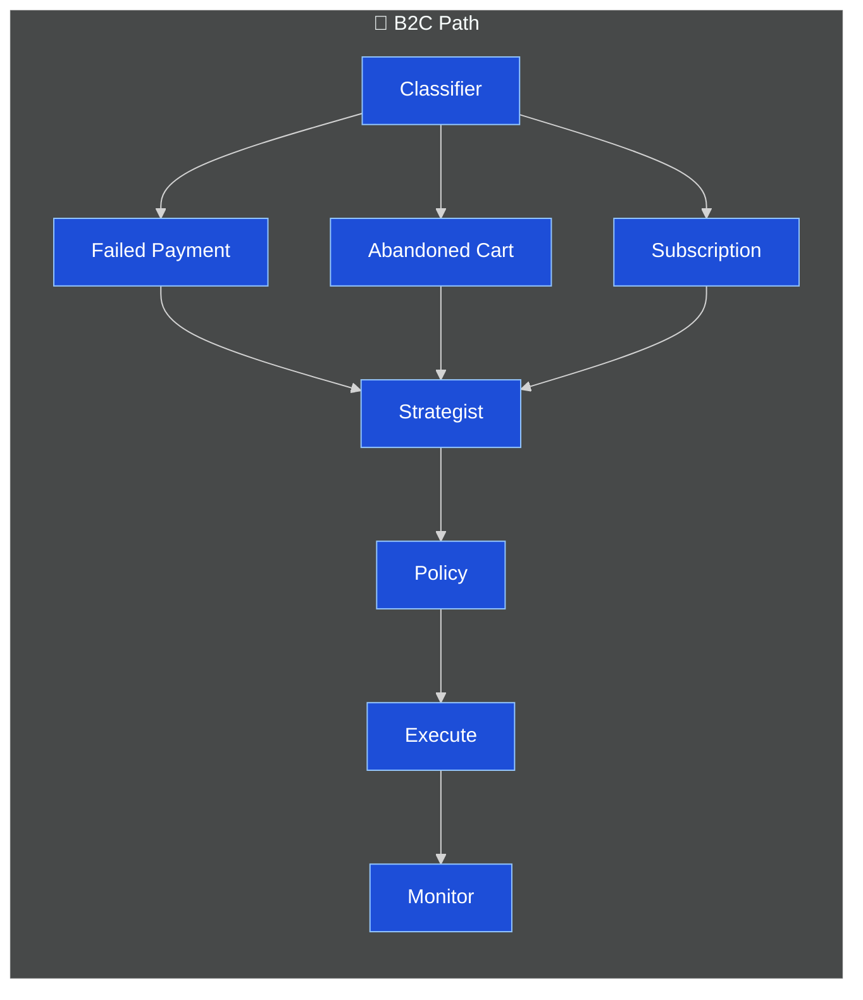

### B2C actions the strategist can choose

`SMART_RETRY` · `CREATE_PAYMENT_LINK` · `SEND_EMAIL` · `SEND_WHATSAPP` · `OFFER_DISCOUNT` · `WAIT` · `ESCALATE_TO_HUMAN` · `STOP`

---

## 🟠 B2B — Receivables & Collections

### How we solve B2B leakage

Overdue invoices are not “failed checkouts.” They need **collections intelligence**:

1. **Age** the invoice (1–30 / 31–60 / 61–90 / 90+).
2. **Tier** by value (HIGH / MEDIUM / LOW).
3. **Read history** — on-time rate, prior follow-ups, response pattern.
4. **Plan** — remind, wait (cooldown), escalate (dispute / stuck high-value), or stop (max attempts).
5. **Act** with professional collections tone + payment link.
6. **Bound** autonomy — max follow-ups, no consumer-style discounts, higher auto amount caps, full audit trail.

### B2B agents — parent + sub-nodes

| Agent | Type | Role |
|-------|------|------|
| **Overdue Receivable Specialist** | Parent | Seeds B2B investigation from invoice + signals |
| **Invoice Analyzer** | Sub-node | Aging bucket, invoice tier, urgency, recommended tone |
| **History Analyst** | Sub-node | Payer reliability, risk flags, response pattern |
| **Follow-up Planner** | Sub-node | `REMIND` / `WAIT` / `ESCALATE` / `STOP` (+ cooldown hours) |
| *(then shared)* Strategist → Policy → Execution → Monitor | Shared | Convert plan into executable strategy under B2B rules |

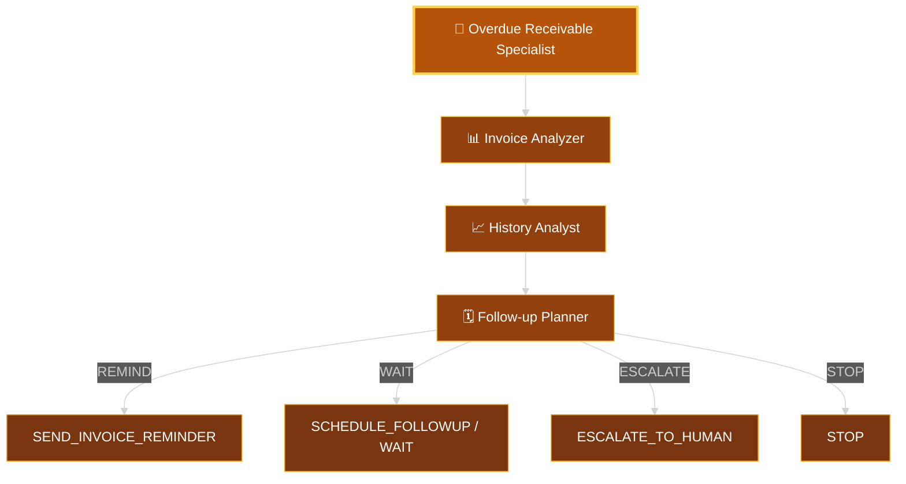

### B2B-specific actions

`SEND_INVOICE_REMINDER` · `SCHEDULE_FOLLOWUP` · `CREATE_PAYMENT_LINK` · `WAIT` · `ESCALATE_TO_HUMAN` · `STOP`

### B2B policy differences

| Guardrail | B2C | B2B |
|-----------|-----|-----|
| Max auto amount | ₹50,000 | ₹500,000 |
| Discounts | Allowed (≤10%) | Blocked |
| Follow-up cap | Message/day limits | Max follow-ups (e.g. 5) + cooldowns |
| Tone | Consumer recovery | Collections (soft → firm → escalate) |

---

## 🧠 Agent Reference Card (All Nodes)

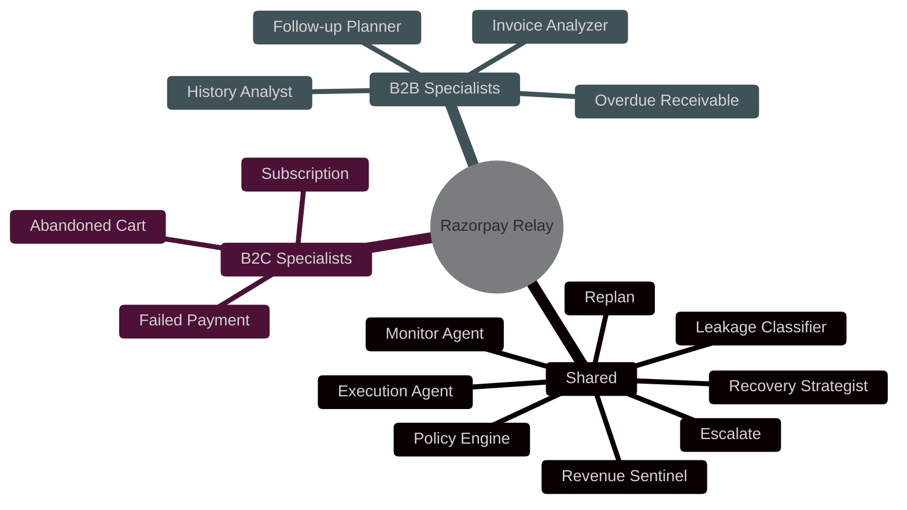

### Shared pipeline (detail)

| # | Node | LLM? | Responsibility |
|---|------|------|----------------|
| 1 | **Revenue Sentinel** | Yes | Detect risk, score urgency & recoverability |
| 2 | **Leakage Classifier** | Yes + rules | Categorize + hard signal overrides (incl. B2B invoice) |
| 3 | **Recovery Strategist** | Yes | Multi-option strategy, copy, channel |
| 4 | **Policy Engine** | **No** | Hard business constraints — cannot be overridden by the LLM |
| 5 | **Execution Agent** | Tools | Payment links, email, WhatsApp, retries, schedule follow-up |
| 6 | **Monitor Agent** | Light | Waiting state; payment webhooks complete recovery |
| 7 | **Replan** | Control | Increment replan count → back to Strategist |
| 8 | **Escalate** | Control | Hand off to human when autonomy is exhausted |

> **Bounded autonomy**: the Policy Engine is intentionally deterministic. AI proposes; rules dispose.

---

## 🔄 Closed-Loop State Machine (UML)

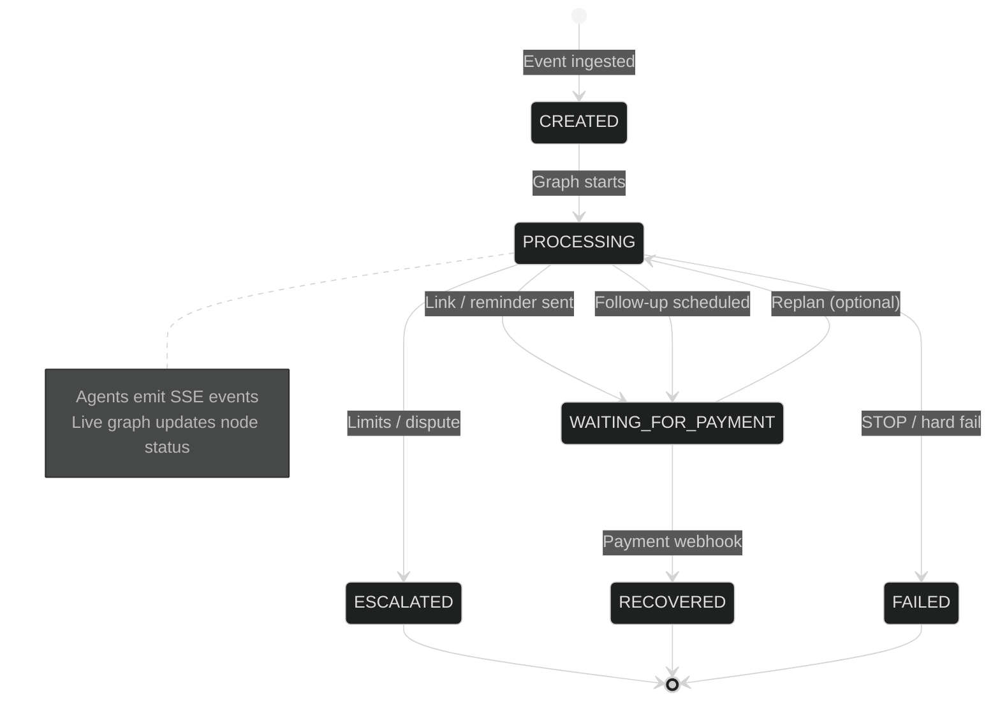

---

## 🏗️ System Architecture

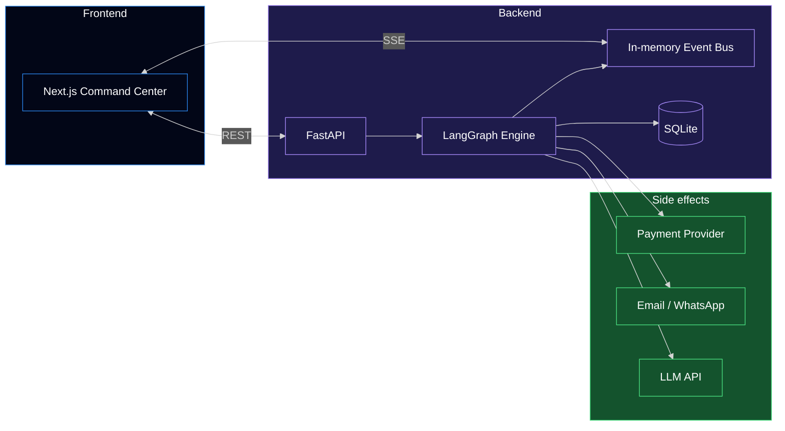

---

## 🎬 Scenarios

### B2C — VIP failed payment
**Trigger:** High-LTV customer, `insufficient_funds`.<br />
**Path:** Classifier → Failed Payment Specialist → Strategist prefers soft `CREATE_PAYMENT_LINK` + email (no harsh tone).<br />
**Result:** Loyalty preserved; payment recovered via link.

### B2C — Abandoned cart
**Trigger:** Checkout started, payment never attempted, inactive 120m.<br />
**Path:** Cart Specialist → Strategist → link + reminder (optional small discount if policy allows).

### B2B — Acknowledged but unpaid
**Trigger:** Invoice 32d overdue, 1 prior follow-up, response = `acknowledged`.<br />
**Path:** Receivable → Invoice Analyzer → History → Follow-up Planner chooses **WAIT** (cooldown) → Execution schedules follow-up.<br />
**Why different:** Nagging an acknowledged buyer reduces recovery and damages the relationship.

### B2B — Disputed invoice
**Trigger:** `response_behavior = disputed`.<br />
**Path:** Follow-up Planner hard-escalates → human collections.<br />
**Why different:** Autonomy stops; disputes need people.

### B2B — Silent overdue, high value
**Trigger:** ₹1,49,999, 75d overdue, ignored reminders.<br />
**Path:** Firm tone reminder or escalate per history + attempt count; policy blocks spam.

---

## 🖥️ Command Center (Frontend)

| Panel | Purpose |
|-------|---------|
| **Trigger form** | Toggle **B2C / B2B**, fire single or batch test events |
| **Live Agent Graph** | Watch nodes turn ACTIVE → COMPLETED (B2B sub-nodes in amber) |
| **Decision Panel** | Selected strategy + alternatives with probabilities |
| **Queue / Case Details** | Segment badge, category, invoice, follow-up plan |
| **Live Console** | SSE orchestration log (agents, tools, decisions, policy) |

---

## 🚀 Getting Started

### Prerequisites
- Node.js 18+
- Python 3.10+
- OpenAI-compatible API key

### 1. Backend
```bash
cd recover-ai/backend
python -m venv .venv

# Windows
.venv\Scripts\activate
# macOS / Linux
source .venv/bin/activate

pip install -r requirements.txt
cp .env.example .env   # set OPENAI_API_KEY (and optional base URL)
python run.py          # http://localhost:8000
```

### 2. Frontend
```bash
cd recover-ai/frontend
npm install
npm run dev            # http://localhost:3000
```

### 3. Try B2B in 30 seconds
1. Open the dashboard → **B2B Receivables**
2. Click **START B2B COLLECTIONS**
3. Watch the live graph: **Overdue Receivable → Invoice Analyzer → History Analyst → Follow-up Planner → Strategist → …**

### 4. Try B2C
1. Switch to **B2C Consumer**
2. Use abandoned-cart or failed-payment signals
3. Watch the blue specialist path light up

---

## 📦 Project Layout

```
recover-ai/
├── backend/
│   └── app/
│       ├── agents/          # Sentinel, classifier, B2C + B2B specialists, strategist, execution, monitor
│       ├── graph/           # StateGraph, routing, RecoveryState
│       ├── policies/        # Deterministic Policy Engine
│       ├── api/             # REST + SSE + webhooks
│       ├── services/        # Orchestration, providers, event bus
│       └── schemas/         # Events, agent outputs, cases
└── frontend/
    ├── components/agent/    # Live Agent Graph, console, decision panel
    ├── components/recovery/ # Trigger (B2C/B2B), queue, case details
    └── hooks/               # SSE recovery stream
```

---

## ✨ Summary

**Razorpay Relay** turns revenue recovery from a static reminder workflow into an **adaptive multi-agent system**:

- **B2C** recovers failed payments, carts, and subscriptions with context-aware interventions  
- **B2B** runs a full receivables sub-graph (analyze → history → plan) before acting  
- **Policy** keeps autonomy bounded  
- **Live Agent Graph** makes every decision and sub-node visible in real time  

> Detect → Diagnose → Decide → Act → Observe → Replan — with measurable revenue recovered.

---

<div align="center">
  <p><strong>Razorpay Relay</strong> — Autonomous recovery for consumer payments & B2B receivables.</p>
  <p>Built with LangGraph · FastAPI · Next.js · React Flow</p>
</div>
