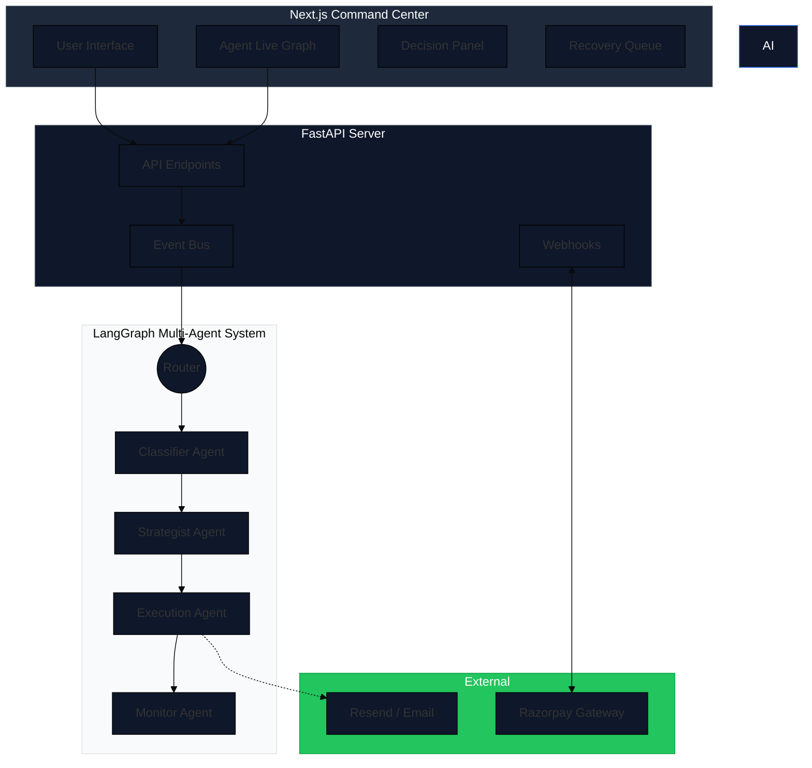
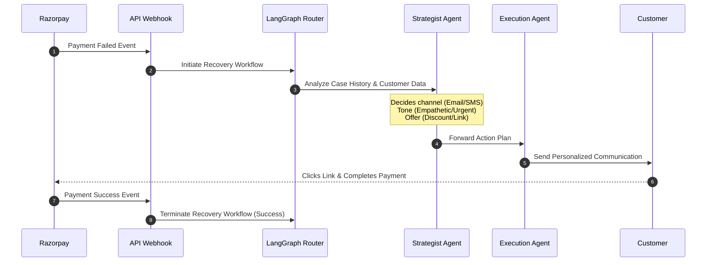

<div align="center">
  
  <h1 align="center">Razorpay Relay</h1>
  <p align="center">
    <strong>An Agentic AI Revenue Recovery Orchestrator</strong>
    <br />
    Turn failed payments and abandoned carts into successful conversions using intelligent, multi-agent workflows.
  </p>
</div>

<div align="center">
  
  
  
  
  
</div>

<br />

---

## 🌩️ The Problem

In the modern e-commerce and subscription landscape, businesses lose millions to **failed payments** and **abandoned carts**. Traditional recovery methods are static, generic, and heavily rely on pre-set time delays and template emails. They lack context and personalization, leading to low conversion rates.

## 💡 The Solution

**Razorpay Relay** (formerly RecoverAI) is a state-of-the-art **multi-agent orchestration system**. Instead of static rules, it uses a team of specialized AI agents that collaboratively analyze the context of a failed payment, formulate a personalized recovery strategy, execute dynamic outreach, and continuously monitor the customer's response.

### 🔑 Key Features
- **Dynamic Multi-Agent Workflow**: Powered by LangGraph, specialized agents (Strategist, Execution, Monitor, Sentinel) collaborate to recover revenue.
- **Real-Time Agent Dashboard**: A beautiful Next.js frontend to monitor the agent graph in real-time, view live agent decisions, and see recovery queues.
- **Smart Policies**: Adheres to tone guidelines and retry limits to avoid spamming customers.
- **Seamless Integrations**: Mocked (and real) integration with Razorpay webhooks and communication providers (like Resend).

---

## 📸 Sneak Peek (Placeholders)

<div align="center">
  <table style="width: 100%;">
    <tr>
      <td align="center">
        <b>Dashboard & Revenue Metrics</b><br/>
        <i>Track recovered revenue in real-time.</i><br/>
        
      </td>
      <td align="center">
        <b>Agent Live Graph</b><br/>
        <i>Watch agents deliberate and execute.</i><br/>
        
      </td>
    </tr>
  </table>
</div>
<br/>

*(Note: Replace the placeholders above with actual screenshots of the application!)*

---

## 🧠 System Architecture

The architecture is split into a robust FastAPI & LangGraph backend, and a reactive Next.js frontend dashboard.



---

## 🌊 Agentic Flow

Here is how Razorpay Relay handles a payment failure in real time using LangChain & LangGraph:



---

## 🛠️ Tech Stack

### Frontend
- **Framework**: Next.js 15 (React 19)
- **Styling**: Tailwind CSS & Shadcn UI
- **Visuals**: Framer Motion, XYFlow (React Flow) for Agent Graphs

### Backend
- **Framework**: FastAPI (Python)
- **AI/LLM**: LangChain, LangGraph (Multi-Agent Orchestration)
- **Models**: OpenAI (gpt-4o-mini), Gemini (gemini-2.5-flash)
- **Database**: SQLite / aiosqlite

---

## 🚀 Getting Started

### 1. Clone the repository
```bash
git clone https://github.com/sanyam-15/Buildathon.git
cd Buildathon
```

### 2. Backend Setup
```bash
cd backend
python -m venv .venv
source .venv/Scripts/activate  # On Windows
pip install -r requirements.txt

# Set up environment variables
cp .env.example .env
# Add your OPENAI_API_KEY to .env

# Run the backend
python run.py
```

### 3. Frontend Setup
```bash
cd frontend
npm install

# Run the Next.js dev server
npm run dev
```

### 4. Access the App
Open your browser and navigate to `http://localhost:3000`. You can simulate failed payments directly from the dashboard and watch the agents react in real-time.

---

## 📁 Project Structure

```text
Buildathon/
├── backend/
│   ├── app/
│   │   ├── agents/        # LangGraph nodes (Strategist, Execution, etc.)
│   │   ├── api/           # FastAPI endpoints (Webhooks, Dashboard, Recovery)
│   │   ├── graph/         # State definitions & LangGraph routing
│   │   ├── services/      # Payment & Communication integrations
│   │   └── models/        # Database models (SQLite)
│   └── run.py             # Server entry point
└── frontend/
    ├── app/               # Next.js App Router (Dashboard, Checkout pages)
    ├── components/
    │   ├── agent/         # React Flow Agent Graph & Console
    │   ├── dashboard/     # Revenue Metrics
    │   └── recovery/      # Case queue & trigger forms
    └── hooks/             # Custom React hooks (useRecoveryStream)
```

---

<div align="center">
  <p>Built with ❤️ for intelligent revenue recovery.</p>
</div>
