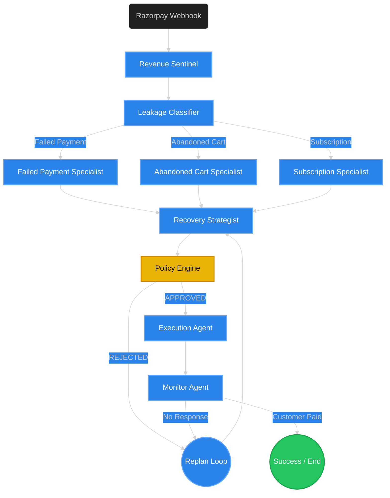
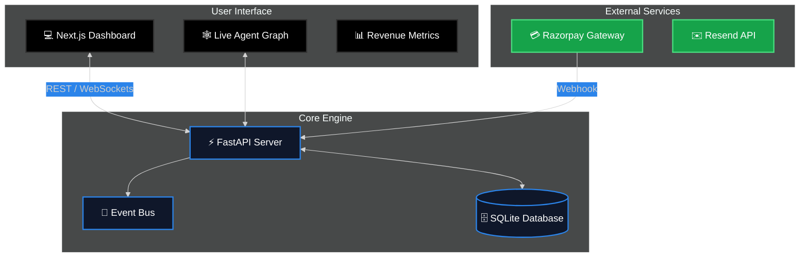

<div align="center">
  <br />
  <h1>🚀 Razorpay Relay</h1>
  <p>
    <strong>Next-Generation Agentic AI for Revenue Recovery</strong>
  </p>
  <p>
    An intelligent, fully autonomous multi-agent orchestration system that analyzes, strategizes, and executes recovery workflows for Failed Payments, Abandoned Carts, and Subscription Churn.
  </p>

  <p>
    <a href="https://github.com/sanyam-15/Buildathon/stargazers"></a>
    
    
    
    
  </p>
</div>

<hr />

## 🌟 The Vision & Problem

E-commerce and subscription platforms bleed millions of dollars annually due to **failed payments** and **abandoned carts**. Traditional recovery solutions rely on rigid if/else statements and generic Drip Email campaigns (e.g., "Wait 24h -> Send Reminder -> Wait 48h -> Send Discount").

**Razorpay Relay** brings Agentic AI to revenue recovery. Instead of hardcoded rules, a swarm of specialized AI Agents investigates the *context* behind the revenue leakage (Is the customer a VIP? Did their card expire? Was it an authentication error?) and formulates a highly personalized, dynamic strategy to recover the funds.

<br />

---

## 🧠 Deep Dive: The Agentic Orchestration

This is not a simple chatbot. Razorpay Relay uses **LangGraph** to build a complex state-machine of collaborative AI agents. Each agent acts as a distinct node in a directed graph.

### 1. Revenue Sentinel & Leakage Classifier
* **Revenue Sentinel**: The entry point of the graph. It ingests raw webhook payloads from Razorpay and enriches the data by querying internal databases for customer history, VIP status, and past transaction records.
* **Leakage Classifier**: Analyzes the enriched data to determine the *type* of leakage. It dynamically routes the graph execution to one of the specialized agents.

### 2. The Specialists
Depending on the classification, the case is routed to an expert agent who analyzes the root cause:
* **Failed Payment Specialist**: Detects if a payment failed due to `insufficient_funds`, `authentication_failed`, or `card_expired`, preparing specific context for the strategist.
* **Abandoned Cart Specialist**: Analyzes cart value and customer intent to determine if they just forgot, or if shipping costs scared them away.
* **Subscription Specialist**: Tracks churn risk and billing cycles to formulate retention context.

### 3. The Recovery Strategist
The core "Brain" of the operation. Taking the output from the specialists, it decides:
* **Channel**: Should we send an Email, an SMS, or trigger an in-app notification?
* **Tone**: Should the message be *Empathetic* (for a long-time VIP whose card expired) or *Urgent* (for a limited-time flash sale)?
* **Offer**: Do we offer a 10% discount, extend their trial, or simply send a direct payment link?

### 4. Policy Engine & Guardrails
Before any action is taken, the **Policy Engine** intercepts the strategy. It acts as an autonomous auditor to ensure we never spam a customer. If the strategy dictates sending 3 emails in 2 hours, the Policy Engine will reject it, forcing the graph to loop back to the Strategist for a `replan`.

### 5. Execution & Monitor Agents
* **Execution Agent**: Takes the approved strategy and interfaces with external tools (like Resend for emails) to craft and deliver the actual personalized message.
* **Monitor Agent**: Enters a wait-state to observe the customer's response. Did they click the link? Did they pay? If they ignore the message for too long, the Monitor Agent can trigger a graph loop back to the Strategist to try a different channel (e.g., switching from Email to SMS).



<br />

---

## 🎬 Real-World Scenarios in Action

### Scenario 1: The VIP Failed Payment
**The Trigger**: A user with $5,000+ Lifetime Value (LTV) has a subscription renewal fail due to `insufficient_funds`.
**The Flow**:
1. **Classifier** routes to **Failed Payment Specialist**.
2. **Strategist** sees the high LTV. Instead of sending a harsh warning, it formulates an *Empathetic* strategy: "Don't worry, your premium access is safe. Update your card when you have time."
3. **Execution Agent** sends a soft-toned email with a secure Razorpay Relay link.
4. **Result**: Brand loyalty is preserved, and the payment is eventually recovered without friction.

### Scenario 2: The Hesitant Cart Abandoner
**The Trigger**: A new customer adds $200 worth of items to their cart but abandons it at the shipping calculation step.
**The Flow**:
1. **Classifier** routes to **Abandoned Cart Specialist**.
2. **Strategist** identifies that the shipping cost likely caused the abandonment. It decides to offer a one-time "Free Shipping" code to close the deal.
3. **Policy Engine** checks if the user has abused discount codes recently. They haven't, so the strategy is approved.
4. **Execution Agent** sends an *Urgent* SMS: "Your cart is waiting! Complete your purchase in the next 2 hours for free shipping."
5. **Result**: The perceived urgency and financial incentive recover a lost sale.

### Scenario 3: The Persistent Failure & Replan
**The Trigger**: A standard user's payment fails. The system sends an email.
**The Flow**:
1. **Monitor Agent** waits 24 hours. The customer opens the email but does not click the payment link.
2. **Monitor Agent** triggers a `replan` and routes back to the **Strategist**.
3. **Strategist** realizes email failed. It generates a new strategy: switch channel to *SMS* and offer a 10% discount.
4. **Result**: The autonomous system adapts dynamically to customer behavior, succeeding where a static drip campaign would have failed.

<br />

---

## 📐 System Architecture

Razorpay Relay is built on a modern, decoupled stack. The backend is a robust Python/FastAPI service driving the LangGraph orchestration, while the frontend is a sleek Next.js dashboard providing real-time observability.



<br />

## 📸 Real-Time Dashboard (Command Center)

The Next.js Frontend isn't just a static dashboard—it's a real-time Command Center built with React Flow (XYFlow) that allows you to watch the AI Agents deliberate, fail, replan, and succeed in real-time.

> **Note for Judges/Reviewers**: Insert actual screenshots of the local application here to showcase the beautiful UI!

<p align="center">
  
</p>

<p align="center">
  
</p>

<br />

## 🚀 Getting Started

Follow these instructions to get a local copy up and running.

### Prerequisites
- Node.js (v18+)
- Python (3.10+)
- OpenAI / Gemini API Keys

### 1. Clone & Install
```bash
git clone https://github.com/sanyam-15/Buildathon.git
cd Buildathon
```

### 2. Backend Environment
```bash
cd backend
python -m venv .venv

# Activate Virtual Environment
# Windows:
.venv\Scripts\activate
# Mac/Linux:
source .venv/bin/activate

pip install -r requirements.txt

# Environment Variables
cp .env.example .env
# Edit .env and add your LLM API keys (OPENAI_API_KEY)
```

### 3. Start the Engines
You need two terminal windows to run the stack.

**Terminal 1 (Backend):**
```bash
cd backend
python run.py
# Server starts on http://localhost:8000
```

**Terminal 2 (Frontend):**
```bash
cd frontend
npm install
npm run dev
# Dashboard starts on http://localhost:3000
```

<br />

---

<div align="center">
  <p>
    Built with 🩵 for the ultimate hackathon experience.
  </p>
</div>
